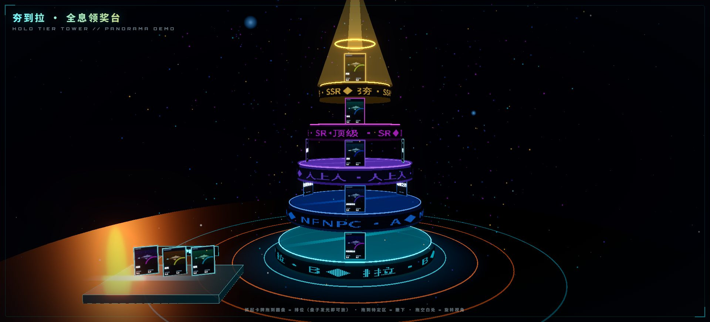
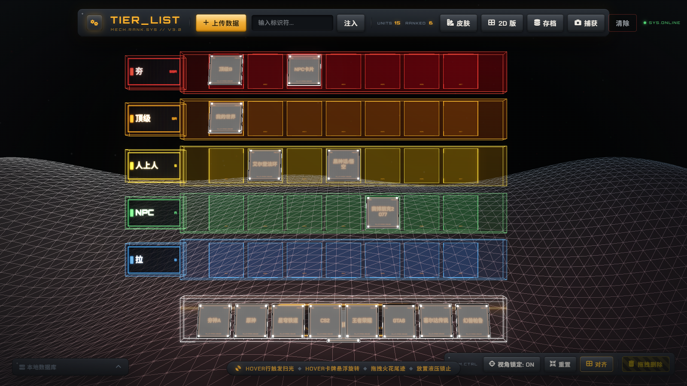
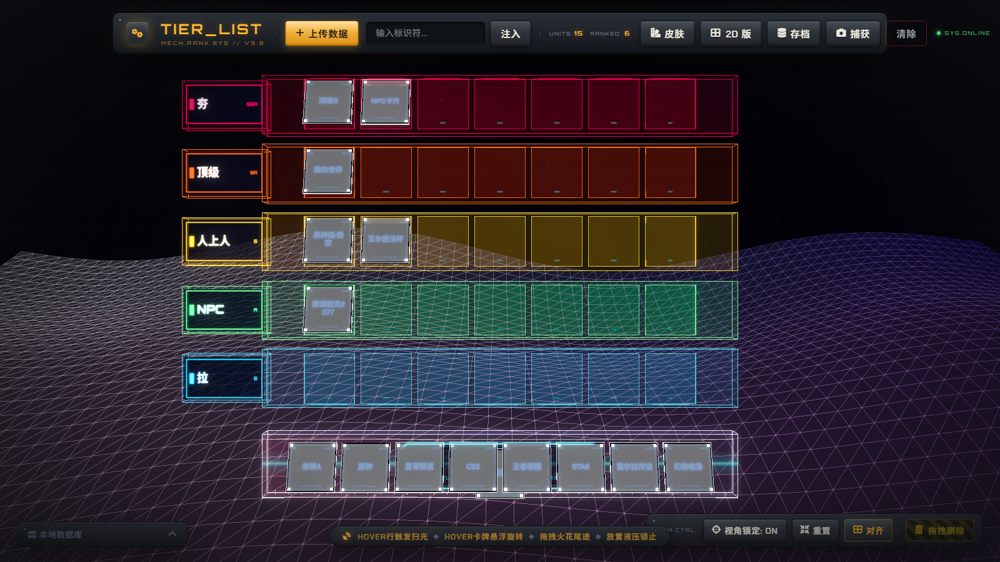
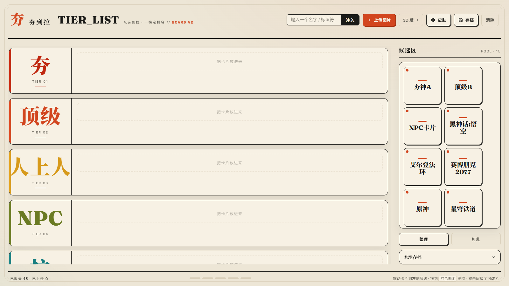
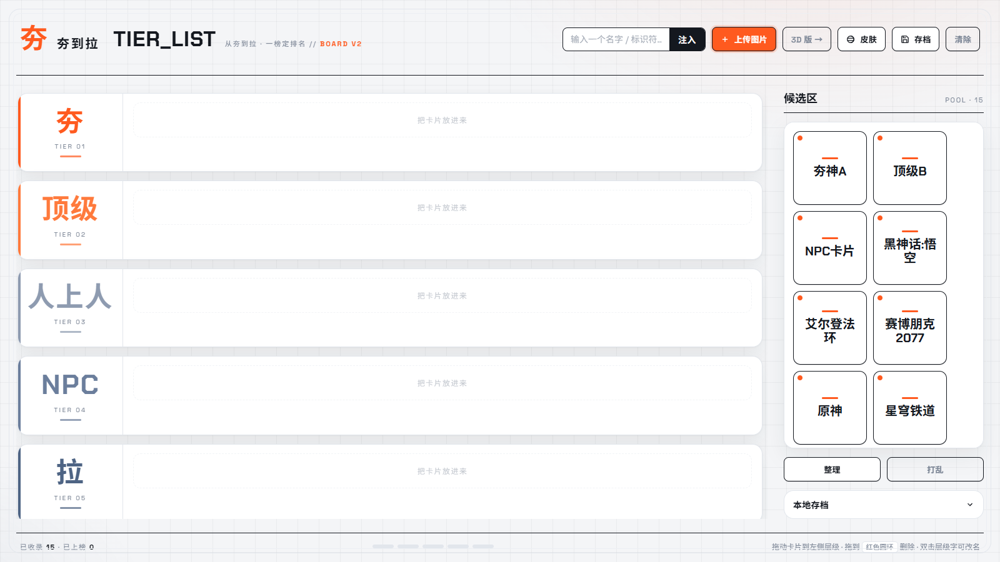

<div align="center">

# 夯到拉演示器 · 3D Tier List

**把「排行榜」从平面表格,搬进全息机舱。**

拖拽卡牌,把万物按「夯 → 拉」排位 —— 液压锁止、火花拖尾、扫光平台,全程 60 帧的 3D 仪式感。

[](https://threejs.org/)
[](https://gsap.com/)
[](https://vitejs.dev/)
[](https://enixz.github.io/3d-tier-list/)
[](https://github.com/enixz/3d-tier-list/releases/latest)

</div>

## 🏆 全息领奖台 · HOLO TIER TOWER

**排行榜的终极形态 —— 五层圆柱霓虹塔。** 卡牌沿盘沿悬浮站立,LED 点阵跑马灯环绕段位,塔顶王冠金光直射,拖到哪个盘、哪个盘发光。



导入图片、注入文本、双击翻转铭牌、粉碎回收、存档读档、一键捕获 —— 主程序有的,它全都有;三个版本共享同一份卡牌数据。

## 📥 免安装,直接用

**在线玩**:[**enixz.github.io/3d-tier-list**](https://enixz.github.io/3d-tier-list/) —— 三个版本全部在线直跑。

不想配环境也不想开网页?下载便携版 [**hangdaola-portable.zip**](https://github.com/enixz/3d-tier-list/releases/latest/download/hangdaola-portable.zip)(或去 [Releases](https://github.com/enixz/3d-tier-list/releases/latest) 页面)——
解压后双击 HTML 文件,浏览器打开即玩,无需 Node、无需服务器:

- `夯到拉-全息领奖台.html` — 全息领奖台(单文件,Three.js 走 CDN)
- `夯到拉-3D.html` — 3D 版(单文件,全部资源内嵌)
- `夯到拉-2D.html` — 2D 版(单文件,零依赖)

> 三版卡牌数据互通,存档保存在浏览器本地。

---

## 📸 实拍画面

一套数据,五种界面 —— 全息领奖台 + 3D / 2D 各两套皮肤,卡牌库存实时共享:

| 3D · 重装机械 MECH | 3D · 全息赛博 CYBER |
| :---: | :---: |
|  |  |

| 2D · 纸墨榜单 | 2D · 白色未来 |
| :---: | :---: |
|  |  |

---

## ✨ 为什么是「夯到拉」?

GitHub 上 2D 的 Tier List 一抓一大把,3D 的 —— 一个没有。
于是有了这个:**可能是全网第一个 3D 分层排行榜生成器**。

- 🃏 **卡牌即数据** — 上传图片或输入文本,瞬间铸成悬浮金属卡牌;双击翻转到铭牌背面
- 🖐️ **全 3D 拖拽** — 在三维空间里抓起卡牌,拖过平台时火花拖尾随行,松手即液压锁止归位
- 🏷️ **层级自定义** — 「夯 / 顶级 / 人上人 / NPC / 拉」五层默认段位,标签随意改名,层级平台扫光待命
- 🎨 **五种界面** — 全息领奖台 + 3D 版双皮肤(重装机械 ⇄ 全息赛博)+ 2D 版双皮肤(纸墨榜单 ⇄ 白色未来),一键切换,卡牌数据实时共享
- 💾 **本地数据库** — 进度随时存档 / 读档,关掉浏览器也不丢
- 📷 **一键捕获** — 截取当前 3D 画面导出图片,直接发群晒榜

## 🎮 交互一览

| 操作 | 效果 |
| --- | --- |
| 悬停平台 | 触发扫光波 |
| 悬停卡牌 | 悬浮 + 旋转展示 |
| 拖拽卡牌 | 火花粒子尾迹 |
| 松手放置 | 液压锁止 + 光束定格 |
| 双击卡牌 | 翻转至铭牌背面 |
| 拖至右下回收区 | 粉碎删除 |
| 视角锁定 OFF | 自由环绕观察重装矩阵 |

## 🚀 快速开始

```bash
npm install
npm run dev      # 开发预览
npm run build    # 构建到 dist/
npm run preview  # 本地预览构建产物
```

> 也可以直接双击 `双击运行.bat`(Windows)。

## 🛠️ 技术栈

- **Three.js** — WebGL 场景、卡牌 / 平台建模、粒子特效、UnrealBloom 泛光后期
- **GSAP** — 全部补间动画:拖拽吸附、锁止回弹、翻转、入场
- **html2canvas** — 画面捕获导出
- **Vite** — 构建与开发服务器
- 零后端,纯前端,所有数据存在浏览器本地

## 📁 项目结构

```
├── index.html        # 3D 版入口
├── holo-tower.html   # 全息领奖台(单文件,Three.js 走 CDN)
├── 夯到拉-2D.html     # 2D 版(单文件,零依赖)
├── main.js           # Three.js 场景 + 全部交互逻辑
├── style.css         # 重装机械皮肤
├── cyber.css         # 全息赛博皮肤
└── vite.config.js
```

---

<div align="center">

**如果这个项目让你眼前一亮,点个 ⭐ Star 就是最大的肯定**

</div>
